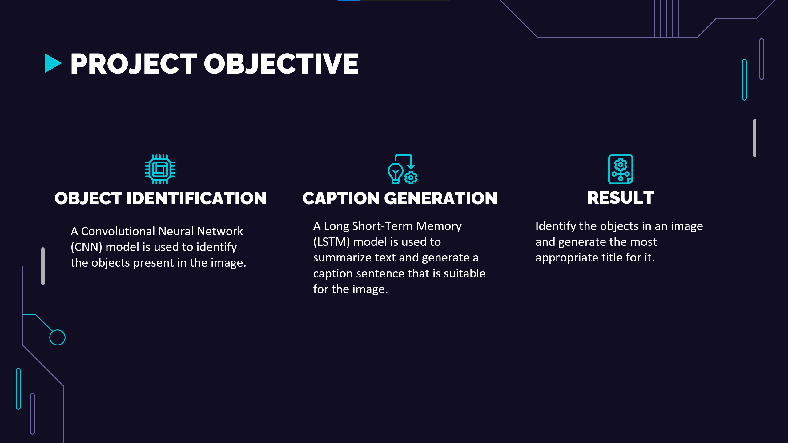

# Project Presentation: Image Captioning and Caption Generation using LSTM and CNN

This is a visual overview of the project on **Image Captioning and Caption Generation** using **LSTM** and **CNN**. The following slides illustrate the project's objectives, methodology, and results.

---

## Presentation Slides

  
  
  ---

  
  ---

  
  ---

  
  ---

  
  ---

  
  ---

  
  ---

  
  ---

  
  ---

  
  ---

  
  ---

  
  ---

  
  ---

  
  ---

  
  ---

  
  ---

  
  ---

  
  ---

  
  ---

  
  ---

  
  ---

  
  ---

  
  ---

  
  ---

  
  ---

  
  ---

  
  ---

  
  ---

  
  ---

  
  ---

  
  ---

  
  ---

  
  ---

---
